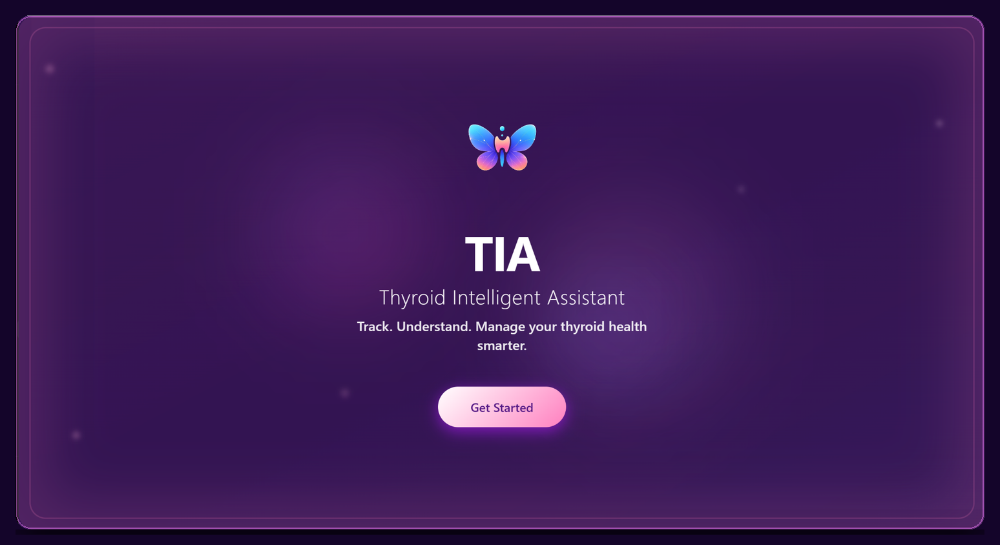
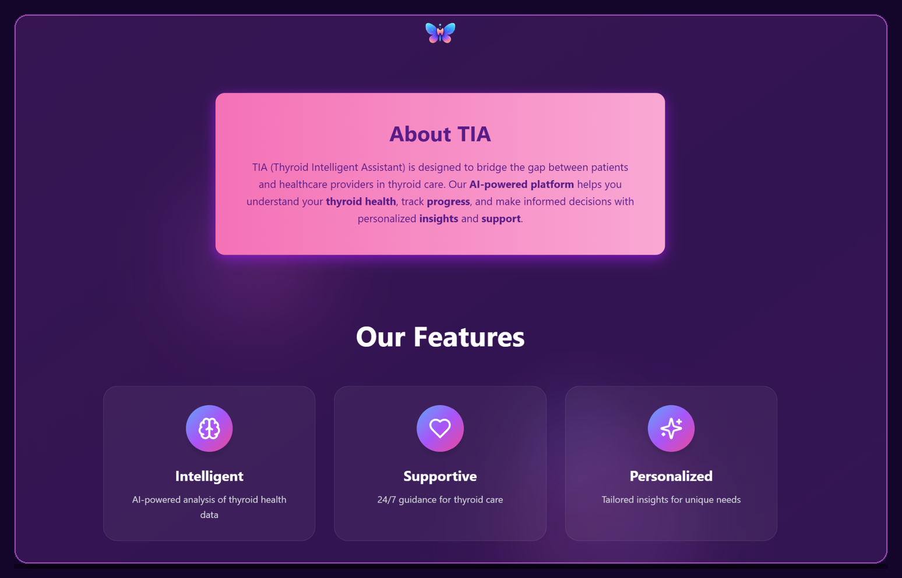
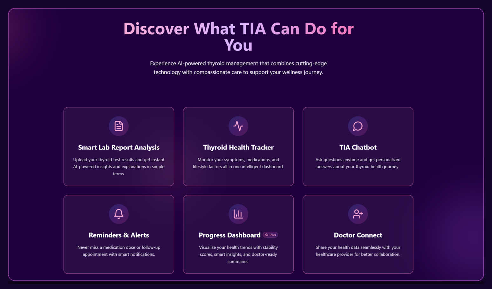
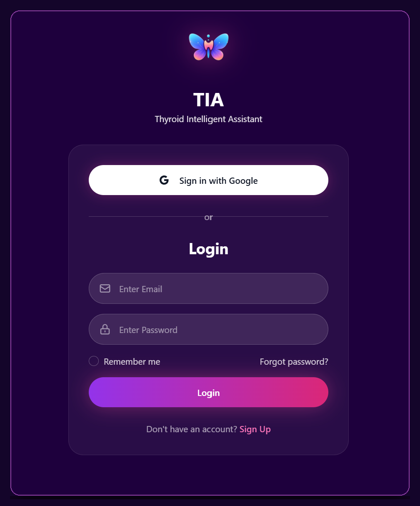

# 🦋 TIA Frontend

> A thoughtful, patient-friendly frontend for the **Thyroid Intelligent Assistant (TIA)**.

TIA is an AI-powered healthcare platform designed to make thyroid health information easier to understand, track, and manage.

The frontend brings together report analysis, health tracking, AI-powered insights, progress visualization, reminders, and doctor connectivity into a simple and approachable experience.

---

## About TIA

TIA - (**Thyroid Intelligent Assistant**), began as an AI project and gradually evolved into a complete healthcare product experience.

The goal is not simply to analyze thyroid reports.

It is to help make complex health information **clearer, more understandable, and easier to engage with.**

The frontend is designed around three core principles:

**Intelligent**  
Use AI to turn complex health information into understandable insights.

**Supportive**  
Create an experience that feels approachable rather than overwhelming.

**Personalized**  
Present insights and health information around the individual's journey.

---

## Core Features

| Feature | What it does |
|---|---|
| 📄 **Smart Lab Report Analysis** | Upload thyroid laboratory reports and receive AI-powered insights from extracted health information. |
| 📊 **Thyroid Health Tracking** | Monitor thyroid-related health information and keep track of important changes over time. |
| 📈 **Historical Trend Analysis** | Visualize previous health information and identify changes and patterns across reports. |
| 🤖 **TIA AI Health Assistant** | Interact with TIA through a conversational interface designed to make thyroid-related information easier to understand. |
| ⚠️ **Risk & Red Flag Detection** | Highlight potentially concerning patterns within the available health information for further attention. |
| 💡 **Personalized Health Insights** | Transform extracted data and analysis into understandable, patient-friendly insights. |
| 🖥️ **Progress Dashboard** | Visualize health trends, stability indicators, insights, and summaries through an interactive dashboard. |
| 👨‍⚕️ **Doctor Connect** | Designed to bridge the gap between patient understanding and professional healthcare support. |
| 🔔 **Reminders & Alerts** | Help users stay aware of important medications, follow-ups, appointments, and other health-related actions. |

---

## Product Preview

TIA is designed around a simple journey:

**Upload → Extract → Interpret → Understand**

The interface follows a consistent visual language throughout the product, using a calm purple and pink palette with the butterfly identity representing TIA.

---

## Landing Experience

The landing page introduces TIA and establishes the product's visual identity.

It focuses on making healthcare technology feel approachable from the very first interaction.



---

## About TIA

The About section introduces TIA's purpose and explains how the platform aims to bridge the gap between patients and healthcare providers.



---

## Feature Overview

The feature page provides an overview of the major capabilities available within the TIA platform.

- Smart Lab Report Analysis
- Thyroid Health Tracker
- TIA Chatbot
- Reminders & Alerts
- Progress Dashboard
- Doctor Connect



---

## How TIA Works

TIA's workflow is built around a simple process:

**1. Upload Report**  
Submit a thyroid laboratory report.

**2. AI Extraction**  
Extract relevant thyroid biomarkers and information from the report.

**3. Interpretation**  
Compare extracted values against relevant reference information.

**4. Personalized Insights**  
Present the resulting analysis in a clearer and more understandable format.


---

## Sign In Experience

The sign-in experience provides the entry point into the TIA platform while maintaining the same visual identity and design language used throughout the product.



---

## Product Design Philosophy

TIA was designed with the belief that healthcare technology should not feel unnecessarily complicated.

The product experience focuses on:

| Principle | What it means |
|---|---|
| **Clarity** | Present complex health information in a way that is easier to understand. |
| **Approachability** | Create a calm and welcoming experience rather than an intimidating clinical interface. |
| **Visualization** | Use dashboards and trends to make changes easier to recognize. |
| **Personalization** | Organize insights around an individual's health journey. |
| **Responsible Design** | Clearly communicate the role and limitations of AI-generated health information. |

The goal is not to replace healthcare professionals.

The goal is to help users **understand their information better and have more informed conversations with their healthcare providers.**

---

## Tech Stack

### Frontend

`React` · `TypeScript` · `Vite`

### UI & Styling

`Tailwind CSS` · `shadcn/ui`

### Application

`React Router` · `Axios`

### Backend Integration

`FastAPI` · `REST APIs`

---

## Frontend Architecture

```text
TIA Frontend
│
├── components/
│   └── Reusable UI components
│
├── pages/
│   └── Application screens
│
├── hooks/
│   └── Reusable React logic
│
├── services/
│   └── API communication
│
├── assets/
│   └── Images, icons and visual assets
│
├── styles/
│   └── Global styling
│
└── App.tsx

```

---

## Project Structure

```text
tia-frontend/
│
├── public/
│
├── src/
│   ├── components/
│   ├── pages/
│   ├── hooks/
│   ├── services/
│   ├── assets/
│   ├── styles/
│   └── App.tsx
│
├── screenshots/
│   ├── landing-page.png
│   ├── about-tia.png
│   ├── features.png
│   ├── how-tia-works.png
│   └── sign-in.png
│
├── package.json
├── vite.config.ts
└── README.md

```

---

## Roadmap

TIA is an evolving project, with future improvements focused on expanding the platform and making the experience more useful, accessible, and connected.

- Authentication improvements
- Patient profiles
- Doctor dashboard
- Enhanced report history
- Notifications and reminders
- Further mobile optimization
- Expanded health visualizations
- Continued UI/UX refinement
- Deeper patient–doctor collaboration

---

## Medical Disclaimer

TIA is designed to provide general health information and educational insights based on available thyroid health data.

It is not a substitute for professional medical advice, diagnosis, or treatment.

Users should consult a qualified healthcare professional for medical decisions or concerns.

---

## Data & Privacy

TIA is designed with healthcare data sensitivity in mind.

The project aims to handle health information responsibly and incorporate appropriate security considerations throughout the application.

---

## Project Status

Active Development

TIA is an evolving project that brings together:

`AI` → `OCR` → `Data Extraction` → `Validation` → `Analysis` → `APIs` → `Database` → `UI` → `Product Design`

